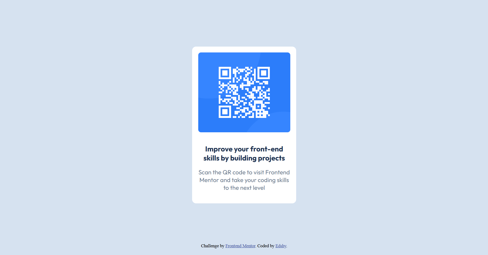

# Frontend Mentor - QR code component solution

This is a solution to the [QR code component challenge on Frontend Mentor](https://www.frontendmentor.io/challenges/qr-code-component-iux_sIO_H).

## Table of contents

  - [Screenshot](#screenshot)
  - [Links](#links)
  - [Built with](#built-with)
  - [What I learned](#what-i-learned)
  - [Author](#author)

### Screenshot

### Links

- Solution URL: [The solution ](https://Edshy.github.io/qr-code-component/)

### Built with

- Semantic HTML5 markup
- CSS custom properties
- Flexbox

### What I learned

I'm happy to have finished this challenge. Honestly, it looks good 😊
I learned new things like how to handle positioning, use Flexbox effectively, and control background sizing.

## Author

- Frontend Mentor - [@Edshy](https://www.frontendmentor.io/profile/Edshy)
- Twitter - [@_vladinho](https://x.com/_vladinho)

